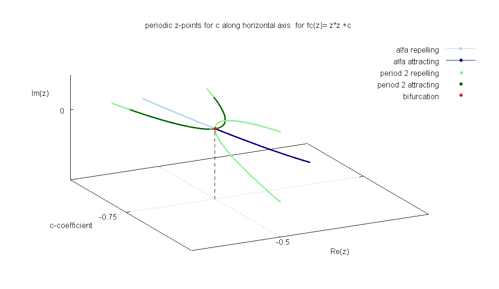
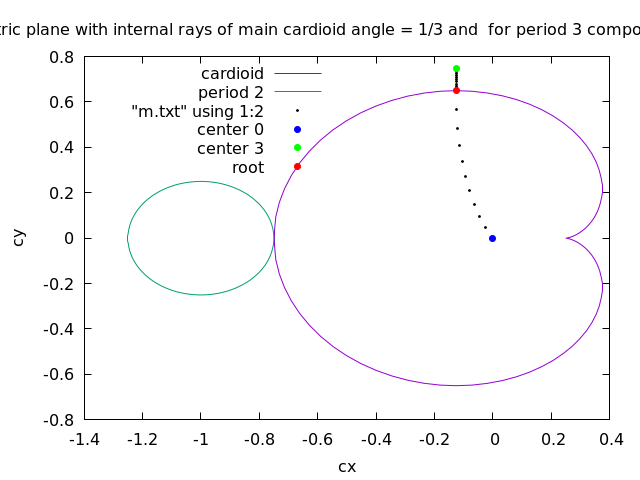
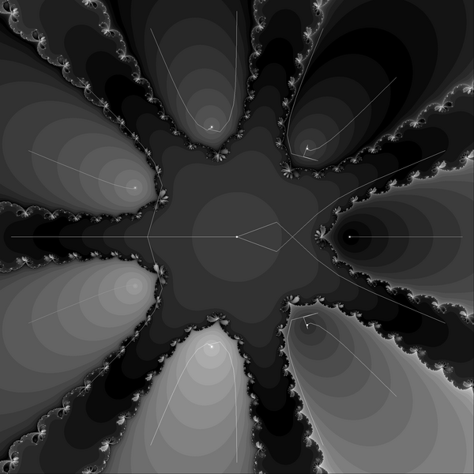

# n-furcation in the Mandelbrot set

* choose path on the parameter plane ( p/q internal ray)
* For parameters from 2d path on the parameter plane one can compute periodic points z (dynamic plan = 2D frame ) 
* draw 3D birurcation diagram from dynamical frames


Periodic points z 
* for period 1  ( fixed point) using explicit method
* for higher periods using [Newton method](https://github.com/adammaj1/periodic-points-of-complex-quadratic-polynomial-using-newton-method)

```c
complex double GiveFixed(complex double c){
/* 

Equation defining fixed points : z^2-z+c = 0
	z*2+c = z
	z^2-z+c = 0

coefficients of standard form ax^2+ bx + c  
 	a = 1 , b = -1 , c = c
 
The discriminant d is 

	d=b^2- 4ac 
	d = 1 - 4c
	
 
 alfa =  (1-sqrt(d))/2 
*/

	complex double d = 1-4*c;
	complex double z = (1-csqrt(d))/2.0;
	return z;

}

```


## Bifurcation = 2-furcation
 


Path on the parameter plane ( along real slice of Mandelbrot set = real axis, all poointa are real, Imaginary part im(c) = 0)
* c = 0 ( interior of period 1 component, center of period 1 component)
* -3/4 > c > 0  ( interior of period 1 component, internal ray 1/2 )
* c = -3/4 ( common point of boundary of period 1 component and period 2 component, root point = bifurcation point)
* -1 > c > -3/4 (interior of period 2 component, internal ray 0  )
 


## Trifurcation = 3-furcation 

 

Path on the parameter plane
* c = 0 ( interior of period 1 component, center of period 1 component)
* from c=0 to c = -0.125000000000000  +0.649519052838329i ( interior of period 1 component, internal ray 1/3 )
* c = -0.125000000000000  +0.649519052838329i ( common point of boundary of period 1 component and period 3 component, root point = bifurcation point)
* from root to center ( interior, internal ray for angle =0)
* center c = -0.122561166876654  +0.744861766619744i (interior,  center of period 3 component)


Here imaginary part is not 0. One can use 
* [the multiplier map](https://en.wikibooks.org/wiki/Fractals/Iterations_in_the_complex_plane/Mandelbrot_set_interior#internal_coordinate_and_multiplier_map) to aproximate c 
* [github repo with c code](https://github.com/adammaj1/multiplier)
* [wikibooks : first derivative wrt z](https://en.wikibooks.org/wiki/Fractals/Mathematics/Derivative#First_derivative_wrt_z)


Period 3 points for c = 0

 

Newton method finds 8 points
* two period 3 cycles
* two fixed points: repellling z=1 and superattracting z=0

```c
 periodic points are: 
 z = +1.000000000000000000; +0.000000000000000000 exact period = 1 stability = 2.000000000000000000
 z = +0.000000000000000000; +0.000000000000000000 exact period = 1 stability = 0.000000000000000000
 
 z = +0.623489801858733531; +0.781831482468029809 exact period = 3 stability = 8.000000000000000000
 z = -0.222520933956314404; +0.974927912181823607 exact period = 3 stability = 8.000000000000000000
 z = -0.900968867902419126; +0.433883739117558120 exact period = 3 stability = 8.000000000000000000
 z = -0.900968867902419126; -0.433883739117558120 exact period = 3 stability = 8.000000000000000000
 z = -0.222520933956314404; -0.974927912181823607 exact period = 3 stability = 8.000000000000000000
 z = +0.623489801858733531; -0.781831482468029809 exact period = 3 stability = 8.000000000000000000

```

Here are 2 repelling period 3 cycles and 2  fixed points ( period 1 cycles )

 


# scr code
* [m.gp](./src/m.gp) - gnuplot bash file for drawing path3.png diagram
* [n.c](./src/n.c) = c file for [finding periodic points using Newton method](https://github.com/adammaj1/periodic-points-of-complex-quadratic-polynomial-using-newton-method)
* [m.c](./src.m.c) = c file for computing c and zf fixed points along internla rays
* [m.txt](./src/m.txt) = txt file with result of m.c program (#  radius cx cy  zxf  zyf ). It will be used for creating graphic 


# git
```git
echo "# " >> README.md
git init
git add README.md
git commit -m "first commit"
git branch -M main
git remote add origin git@github.com:adammaj1/mandelbrot-trifurcation.git
git push -u origin main
```


```git
cd existing_folder
git add .
git commit -m "Initial commit"
git push -u origin main
```


subdirectory

```git
mkdir images
git add *.png
git mv  *.png ./images
git commit -m "move"
git push -u origin main
```

then link the images:

```git
 
```


to overwrite

```git
git mv -f 
```

Local repo 
```
~/Dokumenty/mandelbrot-trifurcation/mandelbrot-trifurcation/
```

