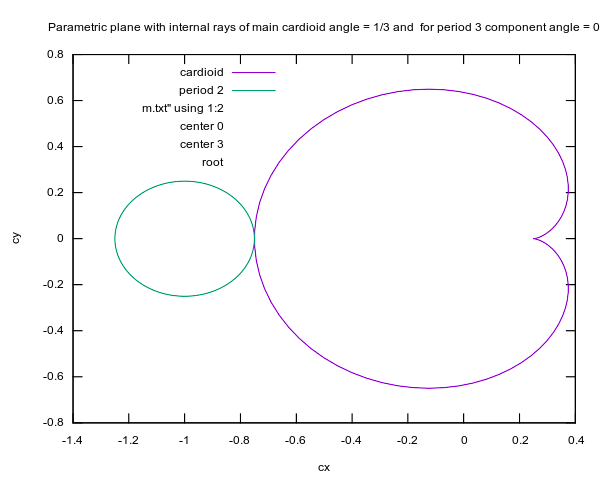

# n-furcation in the Mandelbrot set


## Bifurcation

Path on the parameter plane ( along real slice of Mandelbrot set = real axis, all poointa are real, Imaginary part im(c) = 0)
* c > 1/4 ( exterior of Mandelbrot set)
* c = 1/4 (boundary of period 1 component,  cusp)
* 1/4 > c > 0  ( interior of period 1 component, internal ray 0 )
* c = 0 ( interior of period 1 component, center of period 1 component)
* -3/4 > c > 0  ( interior of period 1 component, internal ray 1/2 )
* c = -3/4 ( common point of boundary of period 1 component and period 2 component, root point = bifurcation point)
* -1 > c > -3/4 (interior of period 2 component, internal ray 0  )
 

## Trifurcation 

 

Path on the parameter plane
* c = 0 ( interior of period 1 component, center of period 1 component)
* from c=0 to c = -0.125000000000000  +0.649519052838329i ( interior of period 1 component, internal ray 1/3 )
* c = -0.125000000000000  +0.649519052838329i ( common point of boundary of period 1 component and period 3 component, root point = bifurcation point)
* from root to center c = -0.122561166876654  +0.744861766619744 i (interior,  center of period 3 component)

Here imaginary part is not 0. One can use 
* [the multiplier map](https://en.wikibooks.org/wiki/Fractals/Iterations_in_the_complex_plane/Mandelbrot_set_interior#internal_coordinate_and_multiplier_map) to aproximate c 
* [github repo wit c code](https://github.com/adammaj1/multiplier)
* [wikibooks : first derivative wrt z](https://en.wikibooks.org/wiki/Fractals/Mathematics/Derivative#First_derivative_wrt_z)


# git
```git
echo "# " >> README.md
git init
git add README.md
git commit -m "first commit"
git branch -M main
git remote add origin git@github.com:adammaj1/mandelbrot-trifurcation.git
git push -u origin main
```


```git
cd existing_folder
git add .
git commit -m "Initial commit"
git push -u origin main
```


subdirectory

```git
mkdir images
git add *.png
git mv  *.png ./images
git commit -m "move"
git push -u origin main
```

then link the images:

```git
 
```


to overwrite

```git
git mv -f 
```

Local repo 
```
~/Dokumenty/mandelbrot-trifurcation/mandelbrot-trifurcation/
```

